

Softmed İstekler: [https://istek.softmedyazilim.com/](https://istek.softmedyazilim.com)

# Self Kuaför - Yardım Dokümanı

Merhaba! Bu dokümanda Self Kuaför web uygulamasının kullanımıyla ilgili tüm önemli bilgilere ulaşabilirsiniz.

---

## İçindekiler

- [Başlangıç](#başlangıç)
- [Kullanıcı Girişi](#kullanıcı-girişi)
- [Ana Sayfa ve Modüller](#ana-sayfa-ve-modüller)
  - [Müşteri Yönetimi](#müşteri-yönetimi)
  - [Randevu Yönetimi](#randevu-yönetimi)
  - [Hizmet ve Personel Yönetimi](#hizmet-ve-personel-yönetimi)
  - [Fatura İşlemleri](#fatura-işlemleri)
  - [Kasa Hareketleri](#kasa-hareketleri)
  - [Stok Takibi](#stok-takibi)
  - [Ayarlar ve Tanımlar](#ayarlar-ve-tanımlar)
  - [Paketler](#Paketler)
  - [Kontör](#Kontör)
  - [İşlemlerim](#İşlemlerim)
  - [İletişim](#İletişim)

---

## Başlangıç

1. Web adresi: [https://app.selfkuafor.com/](https://app.selfkuafor.com)
2. Giriş ekranı üzerinden kullanıcı adı ve şifrenizle sisteme erişin.
3. İlk ayarlarınızı yaparak kullanıma başlayın.

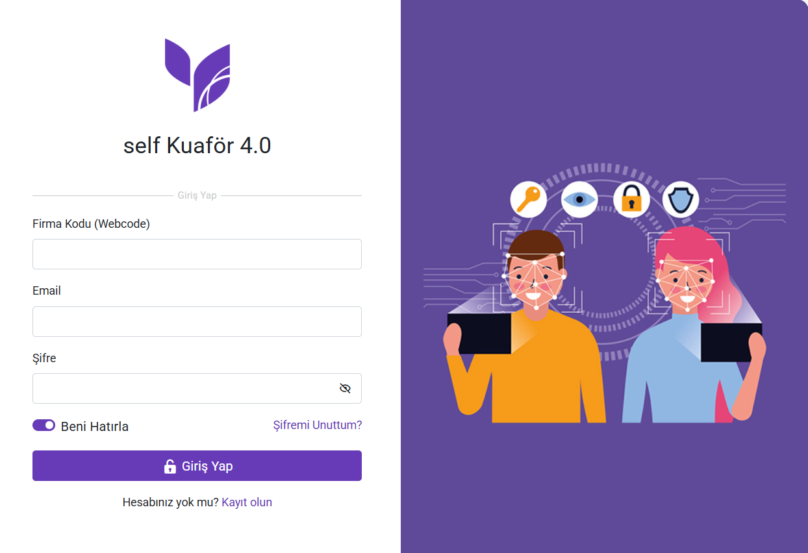

---

---

## Kullanıcı Girişi

- Kayıtlı kullanıcılar giriş yapabilir.
- Şifresini unutanlar "Şifremi Unuttum" seçeneğiyle şifre sıfırlayabilir.
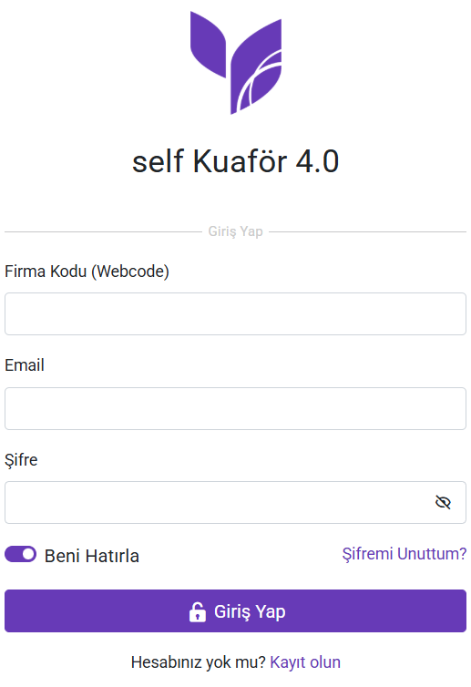

---

## Ana Sayfa ve Modüller
- Giriş yaptıktan sonra, kullanıcılar ana kontrol paneline yönlendirilir. Bu panelde, randevu takvimi, müşteri listesi, Faturalar, Stoklar ve hizmet seçenekleri gibi temel bileşenlere erişim sağlanır.
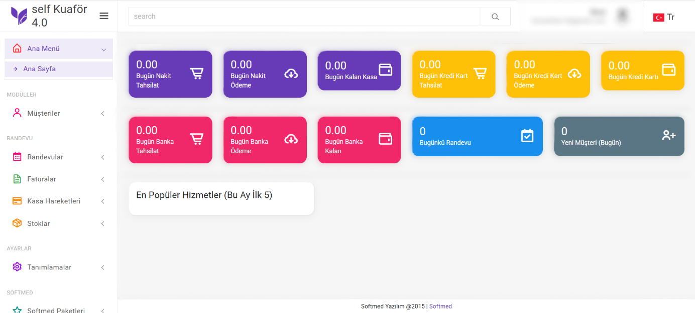

---

### Müşteri Yönetimi

- Yeni müşteri ekleyin: Ad, iletişim bilgileri, notlar.
- Profil görüntüleme: Geçmiş randevular ve notlar.
- 💡 **İpucu:** Müşteri adında arama yaparken büyük/küçük harf duyarlılığı yoktur.
- 💡 **İpucu** Müşteri adına göre arama yaparak geçmişte eklenmiş kayıtlara hızla ulaşabilirsiniz.

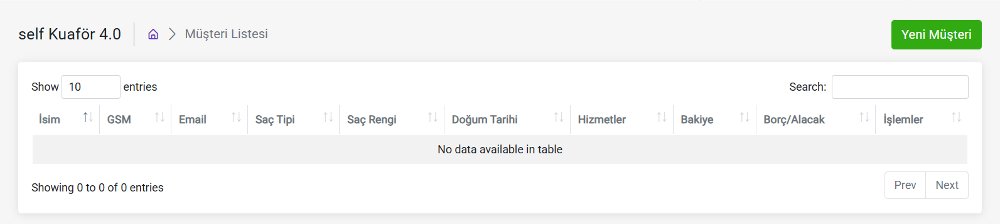
- Yeni Müşteri Kayıt Ekranı
1. Ana menüden "Müşteriler" sekmesine tıklayın.
2. "Yeni Müşteri" butonuna tıklayın.
3. Açılan formda Ad, Soyad, Telefon, E-posta gibi bilgileri doldurun.
4. Kaydet butonuna tıklayarak müşteriyi ekleyin.

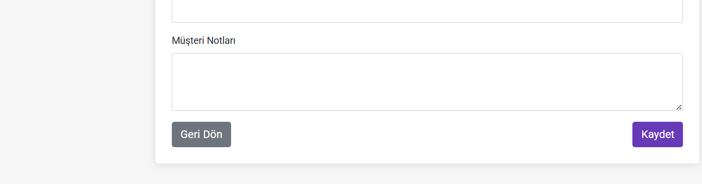

- Müşteri Takibi
  - Müşteri takibi, bir işletmenin müşterilerle satış sonrası etkileşimlerini düzenli ve stratejik bir şekilde yönetmesidir. Amacı, müşteri memnuniyetini artırmak, ilişkileri güçlendirmek ve uzun vadeli sadakat oluşturmaktır.

### Randevu Yönetimi

- Yeni randevu oluşturun
Yeni Randevu Oluşturma(Randevu Listesi): Kullanıcılar, tarih ve saat seçerek yeni randevular oluşturabilirler.
1. "Randevular" sekmesine girin.
2. Takvimde ilgili tarihi seçin.
3. Açılan pencerede müşteri, hizmet, personel ve saat bilgilerini girin.
4. "Kaydet" ile randevuyu oluşturun.
Randevu Düzenleme(Randevu Listesi): Mevcut randevular, ihtiyaçlara göre düzenlenebilir veya iptal edilebilir.
- Mevcut randevuları düzenleyin/iptal edin
Randevu Düzenleme(Randevu Listesi): Mevcut randevular, ihtiyaçlara göre düzenlenebilir veya iptal edilebilir.
- Mevcut bir randevunun üzerine tıklayarak tarih, saat veya müşteri bilgilerini değiştirebilir ya da randevuyu iptal edebilirsiniz.
- Takvim görünümü: Günlük, haftalık, aylık
- ⚠️ **Not** Randevular çakışmalara karşı sistem tarafından otomatik kontrol edilir.

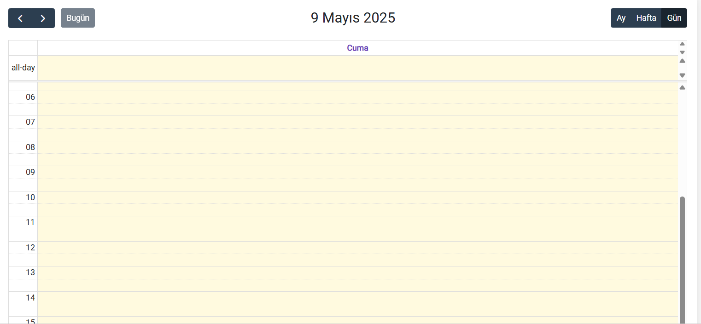
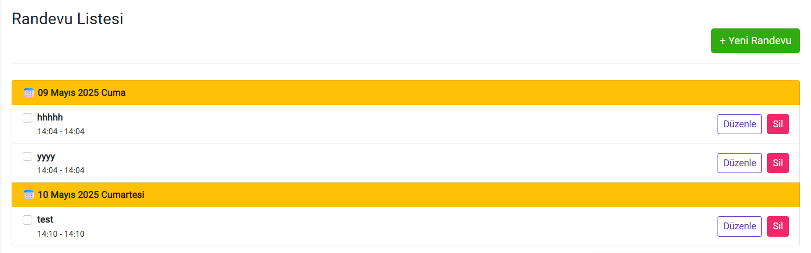

### Hizmet ve Personel Yönetimi

- Hizmet tanımlanabilir ve yeni hizmet eklenebilir.
- Yeni hizmet ekleme, güncelleme ve silme işlemleri kolayca yapılabilir.
- Yeni Hizmet Ekleme: Girilmesi gereken bilgiler;
Hizmet Adı (Örn: Saç Kesimi, Sakal Kesimi, Manikür, Cilt Bakımı)
Fiyat
Açıklama/Bilgilendirme Notu
- Hizmet Güncelleme ve Silme:
Tanımlanmış hizmetler daha sonra fiyat güncellemesi, süre değişikliği veya kaldırma işlemiyle kolayca yönetilebilir.

### Fatura İşlemleri
- Faturalandırma sürecini dijitalleştirerek hızlı işlem yapılmasını sağlar. Müşteri bazlı fatura takibi yapılabilir.
1. Randevu tamamlandıktan sonra ödeme ekranına geçin.
2. Alınan hizmet(ler) otomatik olarak faturaya eklenir.
3. Ödeme türü seçilir (Nakit, Kart, Online vb.).
4. "Fatura Oluştur" butonuna tıklanır.
- Fatura Bilgileri:
Fatura No 
Müşteri Adı
Alınan Hizmet(ler)
Hizmet Tutarı 
Uygulayan Personel
Tarih ve Saat
Toplam Tutar
Ödeme Türü (Nakit, Kredi Kartı, Online vb.)
- Fatura Önizleme ve Yazdırma:
“Fatura Görüntüle” veya “PDF olarak indir” seçenekleri ile çıktı alınabilir.
- Fatura Geçmişi:
Her müşteri için geçmişteki tüm faturalara sistemden ulaşılabilir.
Tarih, hizmet, personel bazlı filtreleme yapılabilir.

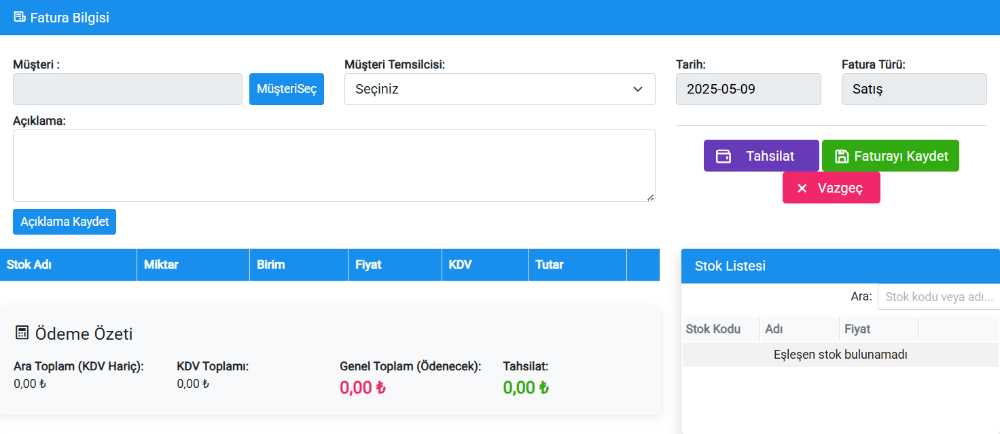
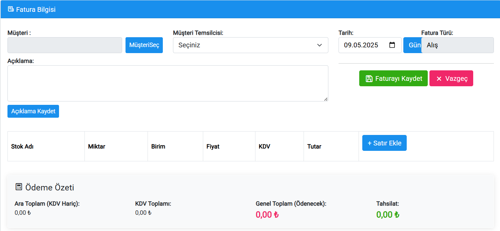
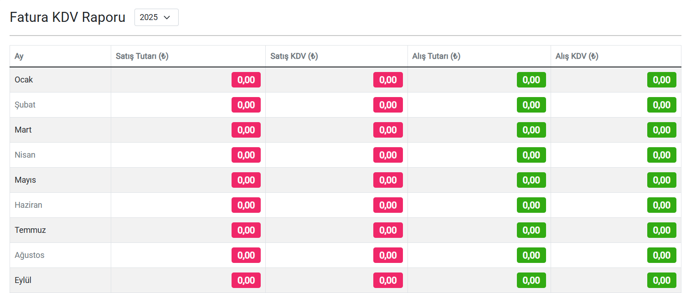

### Kasa Hareketleri

- Kasa modülü, işletmenizin günlük mali işlemlerini yönetmek, takip etmek ve raporlamak için kullanılır. Gelir ve giderlerin detaylı bir şekilde görüntülenebildiği bu ekran sayesinde finansal şeffaflık ve kontrol sağlanır.
- Kasa Listesinde Görüntülenen Bilgiler:
  - İşlem Tarihi: Gelir veya giderin sisteme işlendiği tarih ve saat.
  - Açıklama: İşlemin nedeni (örneğin “Hizmet Ödemesi”, “Ürün Satışı”, “Kira Gideri”).
  - Tutar: İşlemde alınan ya da ödenen miktar.
  - İşlem Türü: Gelir  veya Gider  olarak işaretlenir.
  - Ödeme Türü: Nakit, kredi kartı, havale, vs.
  - İşlemi Yapan Kullanıcı: Hangi personelin işlemi kaydettiği.
  - Kategori (isteğe bağlı): İşlem “Hizmet”, “Ürün Satışı”, “Personel Maaşı” gibi sınıflandırmalara ayrılabilir.

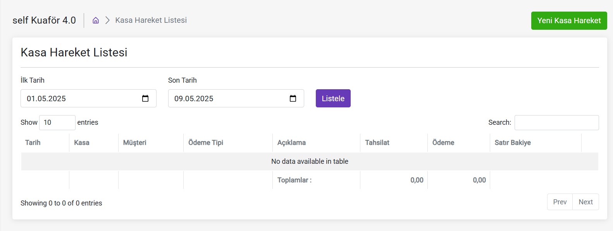

### Stok Takibi

- Stoklar modülü, salonunuzda kullandığınız veya satışa sunduğunuz ürünlerin giriş-çıkışlarını ve miktarlarını takip etmenizi sağlar. Envanterin düzenli takibi sayesinde eksik ürünler zamanında tespit edilir ve maliyet kontrolü sağlanır.
- ⚠️ **Not** Stok miktarı güncelleme, doğru stok seviyelerinin korunması için kritik bir işlemdir. Fiziksel sayımlar ve sistemdeki verilerin karşılaştırılması yoluyla yapılır.

- Ürün Ekleme
Yeni bir ürün sisteme eklenirken aşağıdaki bilgiler girilmelidir:
  - Stok Adı: Ürünün adı
  - Marka: Üretici ya da tedarikçi marka adı
  - Stok Miktarı: Başlangıçta elde bulunan miktar
  - Satış Fiyatı: Eğer satışa sunuluyorsa, müşteriye sunulan fiyat
  - Birim: Adet

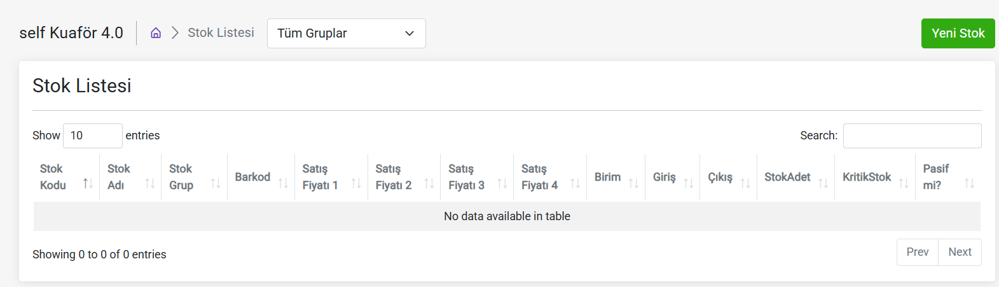

- Stok Miktarı Güncelleme
Kullanım ya da satış sonrası sistem, stok miktarını otomatik düşürür.
Ancak istenirse elle müdahale yapılabilir:
“Stok Güncelle” butonu ile ürün için elle giriş veya çıkış işlemi yapılır.
Giriş ya da çıkış tipi belirtilir.

- Filtreleme ve Arama
- **✅**Ürünlerinizi Kolayca Bulun!
- Ürün adına göre arama yapılabilir.
  - "Stok Yönetimini Kolayca Yapın"

Stoklarınızı izlemek hiç bu kadar kolay olmamıştı! Sipariş verirken, hangi ürünlerin stokta olduğunu ve hangilerinin tükenmek üzere olduğunu anlık olarak görebilir, uygun ürünleri seçebilirsiniz. Ayrıca, sipariş geçmişinizi ve stok durumunuzu hızlıca kontrol edebilirsiniz.
“Stok miktarı azalan” gibi kriterlere göre sıralama yapılabilir.
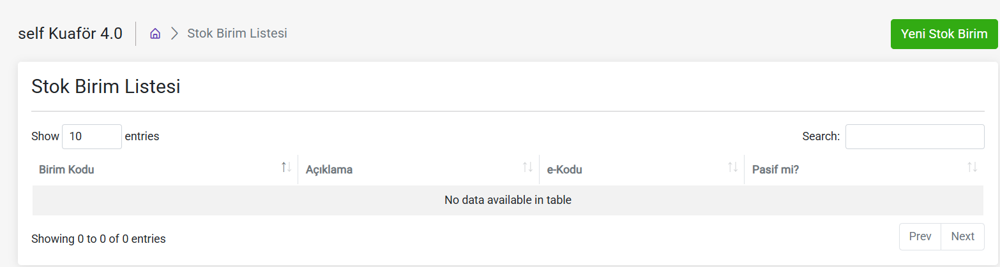
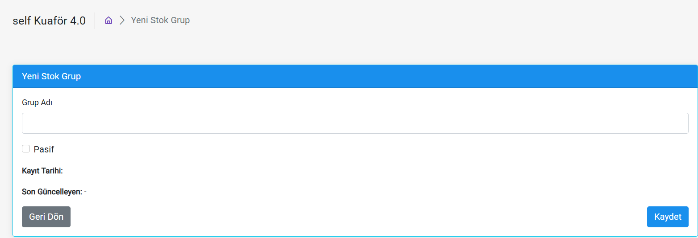

### Raporlama ve Dışa Aktarma

- "İşletmenizin Performansını Kolayca İzleyin ve Paylaşın"
- Belirli bir tarih aralığında personellerin yaptığı satış hareketleri raporlanabilir.
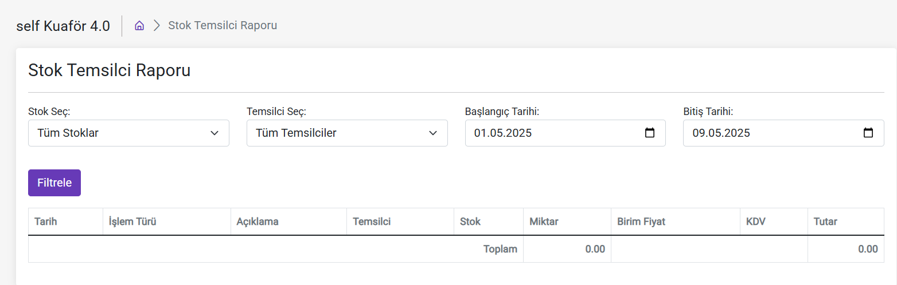

### Ayarlar ve Tanımlar

- Kullanıcı tanımlama: Ad, yetki seviyesi
- Yeni Kullanıcı Ekleme Adımları:
"+ Yeni Kullanıcı" butonuna tıklayın.
Aşağıdaki bilgileri girin:
Kullanıcı Adı
Ad Soyad
Şifre
Yetki Seviyesi (Yönetici / Personel)
Yetki seviyesi belirlenerek kullanıcı sadece belirli menülere erişebilir.
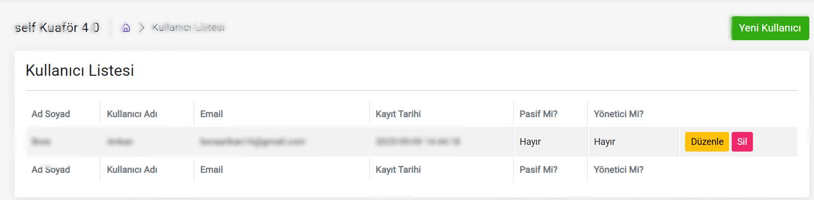

- Kasa Kartı Tanımlama
Kasa işlemlerinin hangi kasa üzerinden yapıldığını belirtmek için kullanılır. (Örn: ana kasa, POS cihazı, el terminali gibi.)

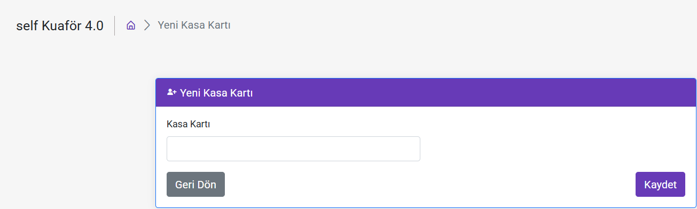

- Kasa Kartı Ekleme:
"+Yeni Kasa" butonuna basın.
Kasa Adı ve Açıklaması girin.
Bu kasa kartları, kasa hareketleri ve raporlama ekranlarında seçilebilir hale gelir 

- Ödeme Tipi Tanımlama:
Ödeme alınırken sistemde görünmesini istediğiniz ödeme yöntemlerini tanımlarsınız

- Örnek Ödeme Tipleri:
Nakit
Kredi Kartı
Havale/EFT
İndirimli Satış
Online Ödeme
Bu ödeme tipleri:
Randevu sonrası ödeme ekranında
Kasa hareketlerinde
Fatura ekranlarında kullanılır.

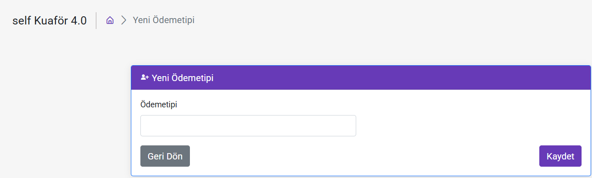

- Açıklama Tanımlama
Kasa giriş ve çıkışlarında sık kullanılan açıklamaların hızlı seçimi için tanımlanır.
- Örnek Açıklamalar:
Ürün Alımı
Müşteri İadesi
Gün Sonu Devri
Nakit Çekimi
Bu açıklamalar, kasa hareketi eklerken hızlıca seçilebilecek şekilde görünür.
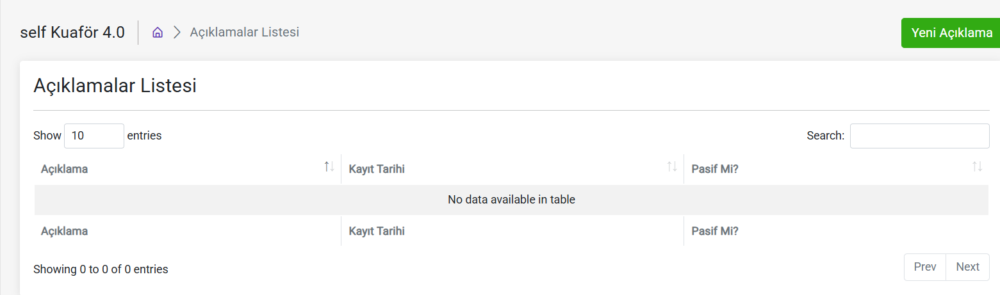

- Fatura Özel Kod Tanımlama
Faturalarda gruplama, özel raporlama veya ayrıştırma yapmak istediğiniz durumlar için kullanılır.
Satış temsilcisi tanımlama ekranı.
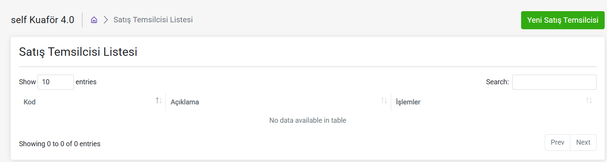
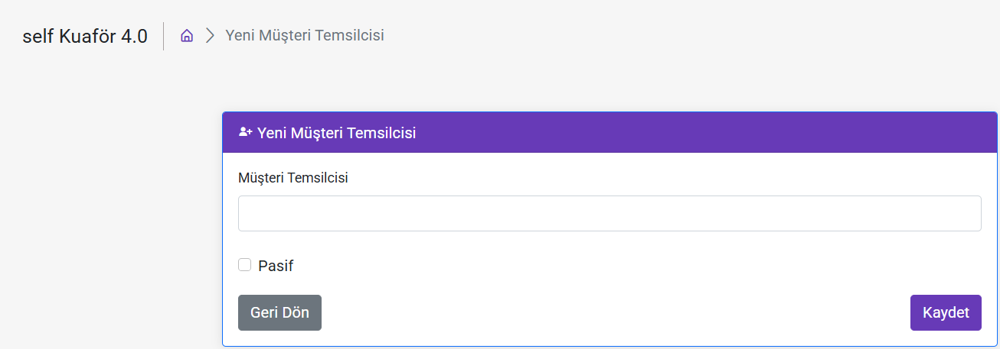

---
### Paketler

- 🎁 Paketler – İhtiyacınıza Uygun Çözümler
Self Kuaför, farklı işletme ihtiyaçlarına uygun olarak çeşitli üyelik paketleri sunar. Her paket, sunduğu hizmet ve personel kapasitesi bakımından farklılık gösterir. Paketler, salonunuzun büyüklüğüne ve ekibinize göre seçilebilir.

- Paket Özellikleri:
  - Salon Hesabı: Her paket bir ana salon hesabı ile gelir.

  - Personel Ekleme: Paketinizin türüne göre belirli sayıda personel ekleme hakkı sunar.

  - Randevu Sistemi: Sınırsız randevu alma ve planlama imkanı sağlar.

  - Gelişmiş Raporlama: İşletme performansınızı takip edebileceğiniz detaylı raporlamalar içerir.

  - Kasa Yönetimi: Gelir-gider takibi yapabileceğiniz bir finans yönetim sistemine sahiptir.

  - Personel Yönetimi: Çalışanlarınızın performansını izleyebilir, görev dağılımlarını planlayabilirsiniz.

  - Takvim Modülü: Günlük, haftalık ve aylık olarak hizmet ve personel takviminizi düzenleyebilirsiniz.

  - Bildirim Sistemi: Randevular, kampanyalar veya hizmetler için hem size hem müşterinize bildirimler gönderilebilir.

  - Kampanya Modülü: Müşterilerinize özel indirim ve kampanyalar tanımlayabilirsiniz.

  - SMS Desteği: Talebe göre SMS hizmeti paketinize entegre edilebilir.
- 🧾 e-Fatura ve e-SMM Aktivasyonu – Dijital Dönüşümünüzü Tamamlayın
 - Salonunuzun dijitalleşme sürecinde e-Fatura ve e-SMM aktivasyonları önemli bir yer tutar. Self Kuaför platformu, bu işlemlerinizi sistem üzerinden kolayca yönetebilmenizi sağlar.

- ✅ e-Fatura Aktivasyonu Nedir?
e-Fatura, klasik kağıt fatura yerine dijital ortamda hazırlanan ve gönderilen resmi bir belgedir. GİB (Gelir İdaresi Başkanlığı) ile entegre çalışan bu sistem sayesinde:

  - Müşterilerinize dijital ortamda fatura kesebilirsiniz.

  - Kağıt, arşiv ve iş gücü maliyetlerinden tasarruf sağlarsınız.

  - Muhasebe süreçlerinizi hızlandırır ve sadeleştirirsiniz.

 - Nasıl Aktifleştirilir?

  - GİB'e e-Fatura başvurusu yaptıktan sonra Self Kuaför panelinizden entegrasyon süreci başlatılır.

  - Teknik destek ekibi gerekli yönlendirmeyi yapar.

  - Entegrasyon tamamlandığında e-Fatura kesmeye başlayabilirsiniz.

- ✅ e-SMM (e-Serbest Meslek Makbuzu) Aktivasyonu Nedir?
Serbest meslek erbabıysanız (örneğin bağımsız çalışan kuaförler, makyaj sanatçıları vb.), müşterilerinize kestiğiniz makbuzların dijital ortamda oluşturulmasına e-SMM denir.

 - Avantajları:

  - Kâğıt makbuzlarla uğraşmazsınız.

  - Resmi ve geçerli belge niteliği taşır.

  - Dijital arşivleme sayesinde belge kaybı riski ortadan kalkar.
  
  
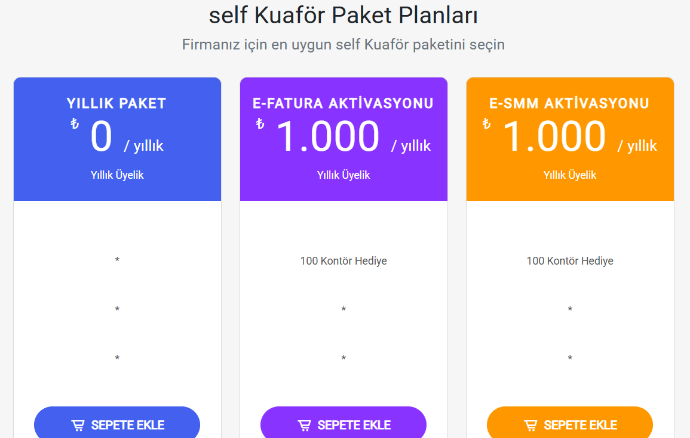

### Kontör
- 💳 Kontör – Esnek ve Kullanışlı Ek Hizmetler
Self Kuaför e-Fatura ve e-Smm gönderimleriniz için kullanababileceğiniz kontör paketleri.

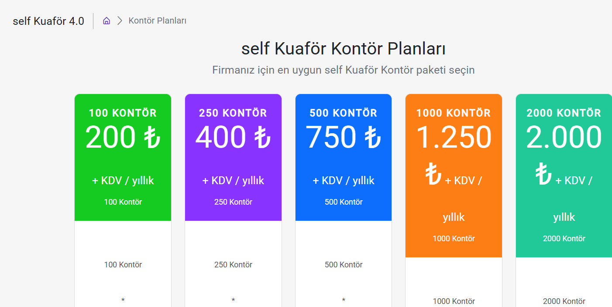
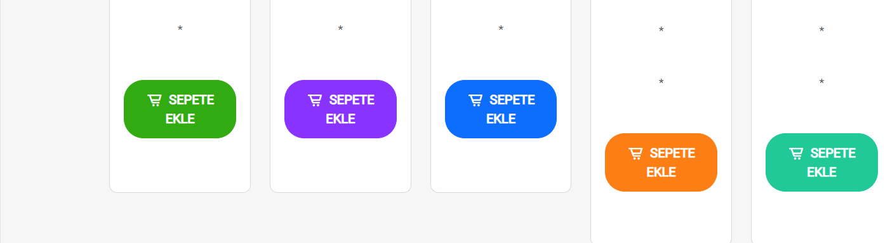

  - ⚠️Paket ücreti ödenmeden yeni bir paket alımı yapılamaz!
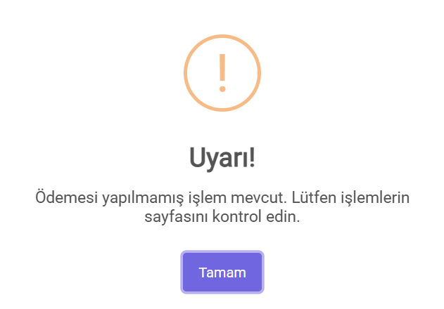 

- İşlemlerinize ve işlem geçmişlerinize kolayca ulaşabilirsiniz!
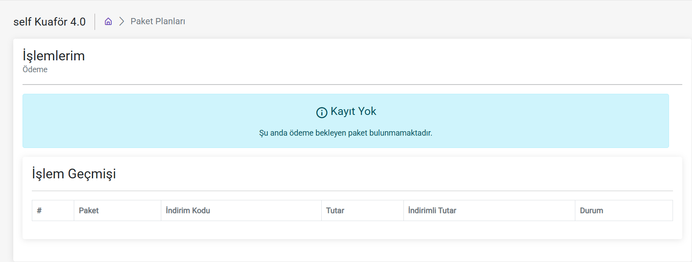

### İşlemlerim
- Satın almış olduğunuz paketleri görüntüleyebilirsiniz ve ödeme yapabilirsiniz!
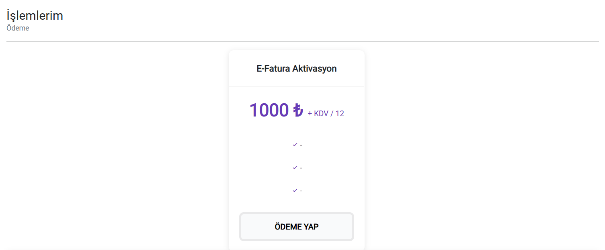
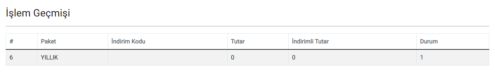

- ✅Ödeme Kolaylığı
💳 iyzico Entegrasyonu – Güvenli ve Kolay Ödeme Alın
Self Kuaför, salon sahiplerinin online ödeme almasını kolaylaştırmak için iyzico ile entegre çalışır. Bu sistem sayesinde müşterilerinizden güvenli ve hızlı bir şekilde ödeme alabilirsiniz.

  - ✅ iyzico Nedir?
iyzico, Türkiye'deki işletmelerin kartla ödeme alabilmesini sağlayan güvenli ve lisanslı bir ödeme altyapısıdır. PCI DSS sertifikalı altyapısıyla, kullanıcı verilerini korur ve hızlı işlem deneyimi sunar.

  - 🔒 Neden iyzico ile Çalışmalısınız?
Güvenli Ödeme Altyapısı: Tüm ödemeler 3D Secure ve PCI-DSS güvenlik standartlarına uygun şekilde gerçekleşir.

  - Kredi Kartı ile Ödeme: Müşterileriniz randevu sırasında ya da sonrasında kredi/banka kartı ile ödeme yapabilir.

  - Kolay Takip: Aldığınız ödemeler sistem üzerinden takip edilebilir.

  - Tek Tıkla Ödeme: Müşteriler daha önce kayıtlı kartlarıyla hızlı ödeme gerçekleştirebilir.

  - Mobil Uyumlu: Hem masaüstü hem mobil cihazlardan ödeme kolaylığı sağlar.

   

---

### İletişim

- E-posta: info@softmedyazilim.com
- Telefon: 0850 532 5920
- Web: [https://softmedyazilim.com/](https://softmedyazilim.com/)

---

**Teşekkürler!**
